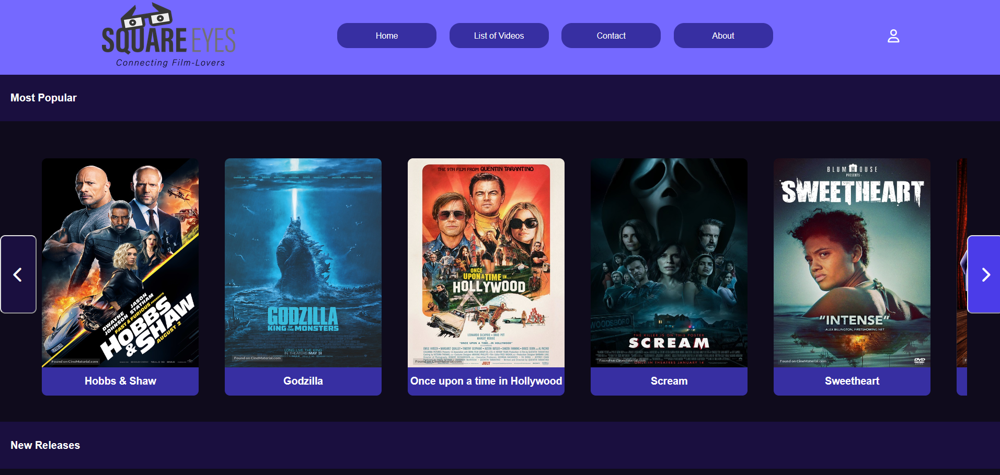

# SquareEyes - Cross Course Project



## Description

SquareEyes was a cross course project during my first year at noroff.
The cross course project task was to create a website for users to purchase movies and critera was that it nedded to be responsive,follow wcag guidelines and be targeted to the right audience.

The website consists of these pages:

- index.html (home page)
- list-of-videos.html (lists all the available movies)
- productpage.html (page for each movie with description)
- checkout.html (checkout page)
- checkoutsucces.html (checkout confirmed page)
- contact.html (page with contact form)
- about.html (page with information about the company)

## Built With

- [HTML 5](https://developer.mozilla.org/en-US/docs/Web/HTML)
- [CSS](https://developer.mozilla.org/en-US/docs/Web/CSS)
- [Javascript](https://developer.mozilla.org/en-US/docs/Web/JavaScript)

- Domain is hosted on one.com and wordpress for the API hosting. Wordpress is setup as headless mode with all the movies hosted in the API.

## Getting Started

### Installing

1. Clone the repo:

```bash
git clone https://github.com/Noroff-Anders/ca_cms_anders-nes.git
```

2. Install the dependencies:

No need to install any dependencies for this project. Project consists of only HTML,CSS and Javascript.

### Running

Project is hosted on netlify:  https://silver-paletas-12f479.netlify.app/index.html.
When repo is cloned you can use liverserver extension to have the website hosted locally on your computer.

## Contributing

This is a school project so no contributions are accepted.

## Contact

- [ My LinkedIn page](https://www.linkedin.com/feed/)

- Email: anders.nes98@gmail.com

## Acknowledgments

[Noroff project modules](https://lms.noroff.no/my/)
